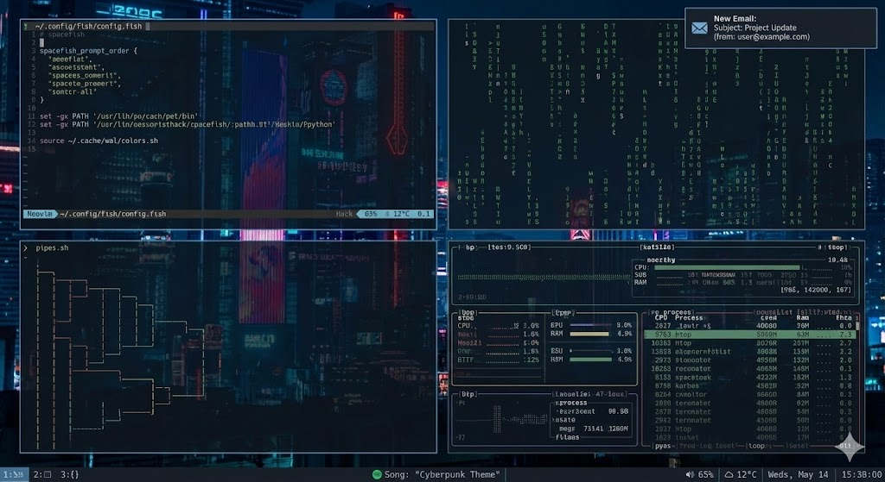

# KM's Linux Desktop Config (chezmoi dotfiles)

  

This is my **chezmoi-managed toolkit** for keeping a 
consistent i3/terminal-focused Linux desktop across 
machines: i3 + i3blocks + i3bar, fish/Zsh/Bash shells, 
kitty/ST terminals, tmux, Neovim/Vim, Ranger, mpv, Zathura, 
dunst, picom, taskwarrior/taskopen, calcurse, Neomutt/msmtp, 
mgba, and a grab bag of helper scripts for wallpapers, 
audio, finance tickers, backups, etc. Other coding projects 
such as `hands-free-tools`, `psa` Arsenal, or `kogito` live 
in their own repos — this repo is solely about the desktop 
environment, shell tooling, and workflows that drive it.

## Table of Contents
- [What This Repo Is](#what-this-repo-is)
- [Installation & Sync](#installation--sync)
- [Shells & Aliases](#shells--aliases)
- [Terminal & Editor Stack](#terminal--editor-stack)
- [Window Manager & Display](#window-manager--display)
- [Productivity Apps & 
  Services](#productivity-apps--services)
- [Scripts, Packages & Assets](#scripts-packages--assets)
- [Host Overrides & Secrets](#host-overrides--secrets)
- [Customization Tips](#customization-tips)

## What This Repo Is
- A **chezmoi repo** with `dot_*` files targeting `$HOME` 
  (e.g. `dot_vimrc.tmpl` &rarr; `~/.vimrc`, `dot_tmux.conf`, 
  `dot_gitconfig.tmpl`, etc.) and `dot_config/**` mirroring 
  `~/.config`. Every `.tmpl` file runs through `chezmoi` 
  templating so `{{ .chezmoi.hostname }}` / `.linux_os` / 
  `.chezmoi.username` can tailor behavior.
- A place for **desktop-focused tooling**: i3/i3blocks, fish 
  + shared aliases, kitty/ST terminals, tmux, Neovim/Vim, 
    mpv, Ranger, mpv, Zathura, dunst/picom/prefers, 
    taskwarrior/taskopen, and shell helpers such as 
    `executable_passmenu`, `dmenu-history`, `change-sink`, 
    `bg-chooser`, etc.
- A repository for configuration logic only — the bulk of 
  application/Project code lives in other repos. You can 
  treat this as the “rice” layer for Arch/Ubuntu machines, 
  not as a general diary of every coding sidequest.

## Installation & Sync
1. Install `chezmoi`, clone this repo, and run `chezmoi init 
--apply <repo>` (or `chezmoi cd .` / `chezmoi apply`). The 
repo assumes you have a basic Linux desktop already (i3, 
fish, etc.).
2. Run `chezmoi apply` whenever you change templates. When 
files touch the ones under `aliases/` (see below) run 
`~/scripts/sync-shortcuts` (or let `fish` invoke it on 
login) to regenerate `~/aliases/.key_aliases`, 
`~/.config/fish/key_abbr.fish`, and 
`~/.config/ranger/key_mappings.conf`.
3. After changing tmux config, reload (`tmux source 
~/.tmux.conf`) and run the TPM installer 
(`~/.tmux/plugins/tpm/bin/install_plugins`).
4. When you edit `dot_config/mgba/*.ini`, run 
`dot_config/mgba/update-mgba-config.fish` (or your shell) to 
keep the `~/.config/mgba/*.ini` copies and repo templates in 
sync.
5. Use `chezmoi data set <key> <value>` (or edit 
`~/.config/chezmoi/chezmoi.toml`) to tweak host data such as 
`gui`, `ext_kb`, or `linux_os` — the template in 
`dot_config/chezmoi/chezmoi-template.toml.tmpl` seeds those 
values for conditional logic in templates.

## Shells & Aliases
- `dot_bashrc` and `dot_zshrc` both source 
  `~/aliases/.key_aliases` and share settings like `xset r 
  rate`, `xmodmap` tweaks, `wal` sequences, 
  `BASH_IT`/`oh-my-zsh` hooks, and `pywal` colors so all 
  interactive shells match.
- `aliases/key_aliases.tmpl`, `aliases/key_dirs.tmpl`, and 
  `aliases/key_files.tmpl` are the canonical 
  alias/directory/file lists. `~/scripts/sync-shortcuts` 
  consumes those to build shell-friendly alias files and 
  ranger mappings; editing a key file there and rerunning 
  that script keeps the shells/ranger in sync.
- Fish is the primary interactive shell 
  (`dot_config/fish/config.fish.tmpl`). It sets `spacefish` 
  prompt order, `PNPM`/`GraalVM`/`Java` paths, 
  `PASSWORD_STORE_CLIP_TIME`, `task` abbrs, and 
  automatically runs `~/scripts/sync-shortcuts` plus 
  `source`-ing every file in `dot_config/fish/functions`. 
  That directory contains dozens of helpers: git helpers 
  (`git/g*`), taskwarrior actions (`task/*.fish`), `watson`, 
  `timetrace`, `tmux-attach`, `pass`/`clipboard` helpers, 
  miniscripts for AWS/rsync, countdowns, `currency` 
  converters, and more.
- `dot_config/fish/completions` adds completions for `buku`, 
  `kogito`, `kubectl`, `minikube`, `pass`, `timetrace`, and 
  `watson` so these workflows stay tab-complete.
- Fish also watches for logins without a `$DISPLAY` to 
  auto-run `startx`, binds `GPG_TTY`, sources 
  `~/.cache/wal/colors.sh`, and respects host-specific 
  values such as `JENKINS_TOKEN` (for NZXT) or `ext_kb`.

## Terminal & Editor Stack
- `dot_config/kitty/kitty.conf` and 
  `dot_config/st/config.def.h.tmpl` share `wal` colors 
  (`~/.cache/wal/colors-kitty.conf` / `colors-wal-st.h`) and 
  Nerd Font setups; kitty enables clipboard control and 
  opacity, st pulls fonts/opacity from the current theme.
- Terminal multiplexer: `dot_tmux.conf` rebinds prefix to 
  `C-Space`, enables mouse, uses a Powerline-style status 
  bar, and installs TPM plugins (`tmux-plugins/tpm`, 
  `tmux-sensible`, `vim-tmux-navigator`). Mouse/Vi copy mode 
  maps push selection to `xclip` via `copy-pipe-and-cancel`.
- `dot_vimrc.tmpl` is the canonical Vim/Neovim config. It 
  enables `autoindent`, autocommands for 
  markdown/Go/Jenkinsfiles, loads `vim-plug`, and wires up 
  plugins (`YouCompleteMe`, `UltiSnips`, `vimtex`, 
  `vim-fugitive`, `vim-auto-save`, `vim-instant-markdown`, 
  `vim-tmux-navigator`, `vim-go`, `vim-react`, `vim-latex`, 
  `vim-mark`, `vim-surround`, `rainbow`, `AutoPairs`, 
  `vim-indexed-search`, etc.). Leader mappings cover 
  yanking, folding, Git, formatting, NERDTree, and quick 
  plugin commands. `dot_config/nvim/init.vim` just sources 
  `~/.vimrc` plus Python host settings.
- `dot_config/mpv/mpv.conf` & `input.conf` configure 
  subtitles, mouse wheel volume, speed keys, seek commands, 
  zoom, and mark shortcuts for mpv so it works cleanly with 
  keyboard/VR-style controls.

## Window Manager & Display
- `dot_xinitrc.tmpl` loads `~/.Xresources`, applies 
  host-specific `xmodmap` (`dot_Xmodmap*`), sets `redshift`, 
  `xset r rate` (pumped from fish), starts 
  `notification-daemon`, `picom`, `imwheel`, `numlockx`, and 
  pains `wal -i $(scripts/shuffler ...)` backgrounds.
- `dot_Xresources.tmpl` keeps host DPI/font choices (high 
  DPI for `x1-carbon`, default for desktops), clickable 
  URLs, transparency, and `sxiv` colors; i3blocks and kitty 
  re-read it via `xrdb` + `wal`.
- There are multiple `dot_Xmodmap*` variants (`.`, 
  `-laptop`, `-laptop-old`, `-old`, `-ubuntu`, `-vm`) so 
  `xmodmap` can swap Caps/Esc/backspace depending on host; 
  `dot_xinitrc.tmpl` toggles between them via the `ext_kb` 
  variable and the helper 
  `scripts/executable_xmodmap-custom.tmpl`.
- `dot_config/i3/config.tmpl` wires up: Mod1/Mod4 split, 
  `kitty`/`urxvt` terminals, i3 startup apps (notification 
  daemon, picom, imwheel, `wal`, `xbacklight`), screenshot 
  bindings, workspace assignments (1/2/3 etc), 
  Slack/Signal/Chromium/Steam assignments, workspace 
  navigation, `passmenu`, `dmenu-history`, `ticker/fx` 
  shortcuts, `redshift` hotkeys, `wal` shuffle hotkeys, 
  `change-sink`, and `mod`-based layout resizing. It also 
  defines stacked/tabbed/floating rules, gap toggles, and 
  bar outputs for both main and secondary monitors. The 
  status command is `i3blocks -vvv -c 
  ~/.config/i3blocks/i3blocks.conf` (primary) and 
  `i3blocks-secondary.conf` (secondary) with i3blocks piping 
  through `~/scripts/shuffler`/`pywal` colors.
- `dot_config/i3blocks/i3blocks.conf.tmpl` defines blocks 
  for `kraken` (ETH), Spotify controls, volume, and 
  conditional blocks for laptop (`battery`, `wifi`, 
  `backlight`), plus placeholders for 
  `dexscreener`/`ticker`/`memory`/`temperature`. Secondary/ 
  display configs reuse the same script directory but focus 
  on `calendar`, `volume`, and additional 
  `temperature`/`name`/`cpu/memory` blocks. Every block 
  relies on scripts under `dot_config/i3blocks/scripts/` 
  (e.g. `executable_calendar`, `executable_volume`, 
  `executable_wifi`, `executable_kraken`, 
  `executable_dexscreener*`, `executable_spotify`, 
  `executable_name`, `executable_temperature`, 
  `executable_ticker`, etc.) which source 
  `~/.cache/wal/colors.sh` to stay on-theme.
- Display/notification stack also includes 
  `dot_config/picom/picom.conf` (shadows/fade/opacity rules) 
  and `dot_config/dunst/dunstrc` (compact, mouse-following 
  notifications, keyboard shortcuts, urgency colors) so 
  popups match the rest of the polished rice.
- `dot_config/neofetch/config.conf` keeps the `neofetch` 
  info streamlined to kernel, terminal,font, shell, 
  packages, WM, CPU/GPU, memory, disks, and resolution, with 
  ASCII color blocks and shorthanded kernel/distro strings.

## Productivity Apps & Services
- `dot_taskrc` configures `taskwarrior` (data location 
  `~/.task`, `taskd` server credentials, urgency 
  coefficients per project/tag, and default context 
  `sniper`). `dot_taskopenrc` tells `taskopen` to use 
  `nvim`, the `task` binary, and custom note / annotation 
  handling (`notes.regex = "Notes"`).
- `dot_qalcrc` forces `qalculate-gtk` to use decimal commas 
  for output. `dot_inputrc` turns readline `vi` mode on, and 
  `dot_imwheelrc` remaps vertical scroll for `imwheel`.
- Ranger customization lives under `dot_config/ranger/`: 
  `rc.conf.tmpl` tweaks view mode, preview pipeline (custom 
  `scope.sh`), bookmarks, colors, and dozens of keybindings 
  (vim-like navigation, copy/paste/paste symlink macros, 
  `fzf` integrations, lightning bookmarks, backgrounds via 
  `wal`, `dragon` drop, etc.). `ranger/commands.py` supplies 
  `fzf_select`, `fzf_locate`, `compress`, `extracthere`, and 
  other helper commands. Plugins include devicons, preview 
  scripts, and shared `key_mappings.conf` (referenced at the 
  bottom of `rc.conf`).
- Email is handled by `dot_config/neomutt/neomuttrc` 
  pointing at `~/mail/firemail`, calling `msmtp`, syncing 
  (`mbsync`), and a custom `<F5>` macro. 
  `dot_config/msmtp/config` defines a `firemail` account — 
  **replace the password with a secret manager or keep this 
  file private** (it currently contains a placeholder 
  password).
- `private_dot_calcurse/` stores Calcurse CalDAV 
  configs/credentials and `private_dot_gnupg/` holds GPG 
  configs/keys; treat those as `chezmoi` private files (they 
  live in `private_dot_*` in the repo and are decrypted on 
  each machine). Similarly, `dot_ssh/authorized_keys-all` 
  and `known_hosts-all` aggregate SSH entries for quick 
  deployment.
- `dot_config/zathura/zathurarc` forces dark mode, custom 
  colors, and clipboard syncing. 
  `dot_config/mgba/*-tmpl.ini` keeps emulator settings; run 
  `dot_config/mgba/update-mgba-config.fish` after editing 
  your local `~/.config/mgba/*.ini` so the template files 
  stay current.
- `dot_minikube/config/config.json` fixes the driver to 
  Docker (`"driver": "docker"`).

## Scripts, Packages & Assets
- The `scripts/` directory hosts dozens of `executable_*` 
  helpers that i3, fish, and launcher aliases depend on. 
  Highlights:
  - `executable_sync-shortcuts` reads `aliases/key_*` and 
    rewrites `~/aliases/.key_aliases`, 
    `~/.config/fish/key_abbr.fish`, and ranger’s 
    `key_mappings.conf`, keeping shells/ranger consistent.
  - Wallpaper helpers: `executable_shuffler` rolls a 
    directory of backgrounds, `executable_bg-chooser` picks 
    "bright"/"dim" sets through `dmenu`, and 
    `executable_dual-monitor-slideshow` uses 
    `feh`/ImageMagick to fill a single monitor while 
    temporarily disabling others.
  - Audio/focus helpers: `executable_change-sink` reroutes 
    Pulseaudio sinks, `executable_ubuntu-start` is an 
    alternative startup script that replays 
    imwheel/picom/wal, and `executable_tex-clean` deletes 
    LaTeX build artefacts based on 
    `txt/tex-build-files.txt`.
  - Productivity utilities: `executable_passmenu` wraps 
    `pass` with `dmenu`, `executable_dmenu-history` keeps 
    colorized dmenu launch history, `executable_vim-man` 
    pops man pages inside Neovim, `executable_currency` hits 
    `frankfurter.app`, `executable_glhf-metadata` queries an 
    NFT API, and 
    `executable_ticker`/`executable_dexscreener*`/`executable_kraken` 
    feed price data to the i3blocks bar.
  - Misc scripts include `executable_backup-pc` (rsync/tar 
    backups using exclude lists under `txt/`), 
    `executable_install-arch-pkgs.sh` (installs from 
    `txt/pacman-pkgs/*.txt`), `executable_spotify-clean` 
    (VACUUM Spotify DB), and 
    `executable_spotify-now`/`dot_config/i3blocks/scripts/executable_spotify` 
    for play/pause+display via MPRIS.
  - `scripts/colors/` contains playful ASCII color art used 
    for celebrations or just curiosity.
- `txt/` contains curated data:
  - `txt/nzxt-pkgs.txt`, `txt/nzxt-aur.txt`, 
    `txt/nzxt-all.txt`, `txt/nzxt-new.txt`, 
    `txt/x1-carbon-pkgs.txt`, `txt/x1-carbon-aur.txt`, 
    `txt/arch-2-pkgs.txt`, `txt/arch-2-aur.txt`, and similar 
    lists for Ubuntu/Termux packages.
  - `txt/exclude-dirs-backup*.txt` provide directory 
    exclusions for backups.
  - `txt/tex-build-files.txt` enumerates LaTeX build 
    extensions for `executable_tex-clean`.
  - `txt/todo.md` and `txt/terminal-art.txt` capture 
    personal notes.
  - `txt/usbs.md` tracks mounted USBs.

## Host Overrides & Secrets
- `dot_config/chezmoi/chezmoi-template.toml.tmpl` flags 
  `gui`, `ext_kb`, and `linux_os` so templates can read 
  host-specific values (e.g., `ext_kb` decides whether 
  desktop laptops load `.Xmodmap` or `.Xmodmap-laptop`). Use 
  `chezmoi data set` (or edit 
  `~/.config/chezmoi/chezmoi.toml`) to change these values 
  per host.
- `dot_Xresources.tmpl` and `dot_Xmodmap*` swap DPI, fonts, 
  and key remaps depending on the machine (`x1-carbon` vs 
  `nzxt` vs `vm`). `i3` bindings invoke `xmodmap ~/.Xmodmap` 
  or the laptop variant depending on those template 
  variables.
- `private_dot_gnupg/` and `private_dot_calcurse/` are 
  `chezmoi` private directories — they contain real 
  keys/certs and are not committed in plaintext. Keep them 
  encrypted and use `chezmoi add --private` when tracking 
  new secrets.
- `dot_config/msmtp/config` currently stores a password. In 
  production, replace it with a `pass`-managed credential or 
  environment variable, and never push secrets to a public 
  repo.
- `dot_taskrc` embeds `taskd` credentials (host 
  `taskd.khkm.gq`), so treat `~/.taskrc` as private if you 
  edit it, and sync it via `chezmoi` private mode if needed.
- `dot_ssh/authorized_keys-all` and `known_hosts-all` 
  collect the SSH state that gets populated on every machine 
  you `chezmoi apply` to.

## Customization Tips
- **Adding aliases/dirs/files**: edit the `aliases/key_*` 
  templates, then run `~/scripts/sync-shortcuts` (or log in 
  through fish and let the config run it) to regenerate 
  shell aliases, fish abbrs, and ranger maps.
- **Changing colors/backgrounds**: the i3 config, 
  `dot_xinitrc`, and 
  `scripts/executable_bg-chooser`/`shuffler` call `wal -i` 
  on directories under `~/Pictures/Backgrounds`. Keep the 
  structure and `feh` call in 
  `scripts/executable_dual-monitor-slideshow` in sync when 
  you add new folders.
- **Updating mgba**: edit your local 
  `~/.config/mgba/config.ini`/`qt.ini`, then run 
  `dot_config/mgba/update-mgba-config.fish` to copy them 
  back into the repo templates before committing.
- **Updating i3blocks**: the configs reference scripts under 
  `dot_config/i3blocks/scripts/`. Editing or adding a script 
  should maintain the `command` naming convention and the 
  `color`/`pywal` sourcing shown in those scripts.
- **Neovim tweaks**: extend `dot_vimrc.tmpl` with new `Plug` 
  entries; after editing, run `nvim +PlugInstall +qall` and 
  keep the plugin list synchronized with `init.vim` sourcing 
  the same file.
- **Tmux tweaks**: change `dot_tmux.conf`, then reload 
  (`tmux source-file`) and reinstall packages via 
  `~/.tmux/plugins/tpm/bin/install_plugins` if you add TPM 
  plugins.
- **Taskwarrior contexts**: `dot_taskrc` defines contexts 
  (`sniper`, `pey`, `mny`, etc.) and urgency coefficients. 
  Edit them if you rename project tags, then run `task 
  sync`.
- **Backup scripts**: `scripts/executable_backup-pc` uses 
  `txt/exclude-dirs-backup*.txt`, so update those lists 
  whenever you add new directories to exclude from 
  `rsync`/`tar` backups.
- **Package installation**: 
  `scripts/executable_install-arch-pkgs.sh` reads 
  `txt/pacman-pkgs/*.txt`. Keep that tree up to date before 
  running the script.

Feel free to browse the scripts, `dot_config/*`, and `txt/*` 
files when you need to understand how a feature works — they 
are the single source of truth for this desktop’s 
automation.